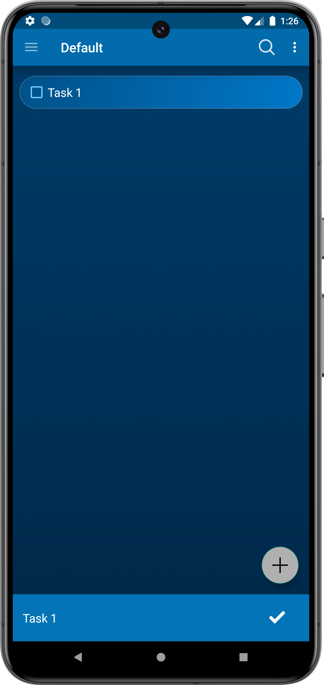
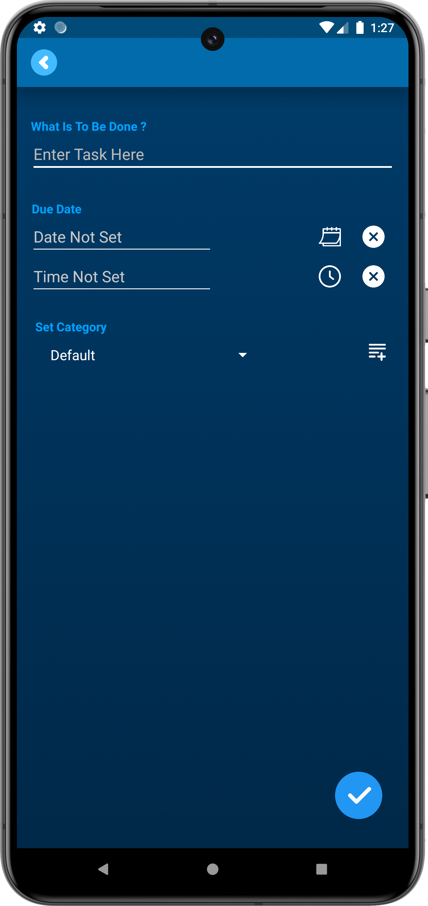
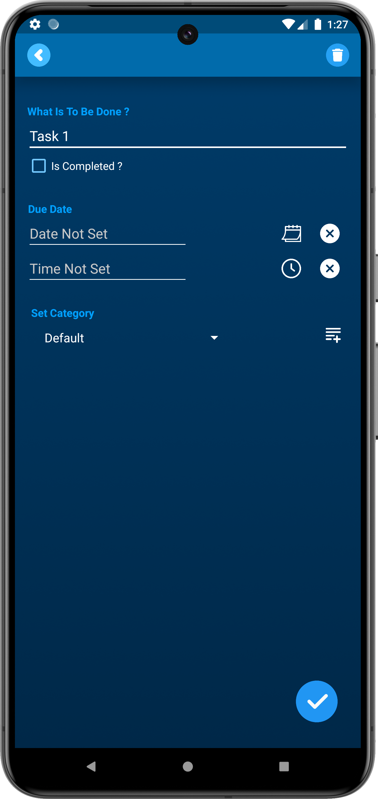

# Todopro App

Todopro is a feature-rich to-do list Android application designed to help you manage your tasks efficiently. It allows you to create, edit, and delete tasks with ease. The app uses RecyclerView to display tasks and SQLite for task management. Additionally, it supports GIFs for a more interactive user experience.

## Features

- **Add Tasks:** Create new tasks with a title and description.
- **Edit Tasks:** Edit existing tasks to update their details.
- **Delete Tasks:** Remove tasks that are no longer needed.
- **Task Completion:** Mark tasks as completed or not completed.
- **Task Filtering:** Filter tasks to show only completed or not completed tasks.
- **Smooth Animations:** Enjoy smooth animations when tasks are added, edited, or removed.
- **Audio Feedback:** Play a sound when a task is marked as completed.

## Screenshots

### Home Screen


### Add Task Screen


### Edit Task Screen


## Installation

To get a local copy of the project up and running on your machine, follow these steps:

### Prerequisites

- Android Studio
- Android SDK
- Java JDK

### Steps

1. Clone the repository:
    ```sh
    git clone https://github.com/NikhilRW/ToDoPro-Android-App.git
    ```

2. Open the project in Android Studio:
    - Launch Android Studio.
    - Click on `File` -> `Open` and navigate to the cloned project directory.
    - Select the project to open it.

3. Build the project:
    - Click on `Build` -> `Make Project` or press `Ctrl+F9` to build the project.

4. Run the app:
    - Connect an Android device or start an emulator.
    - Click on `Run` -> `Run 'app'` or press `Shift+F10` to run the app.

## Usage

- **Add a Task:** Tap the "Add Task" button and enter the task details.
- **Edit a Task:** Tap on an existing task to edit its details.
- **Delete a Task:** Swipe a task to the left or right to delete it.
- **Complete a Task:** Check the checkbox next to a task to mark it as completed.
- **Filter Tasks:** Use the filter option to display only completed or not completed tasks.

## Code Overview

### MainActivity

The main activity of the app where tasks are displayed and managed.

### CustomAdapter

A RecyclerView adapter for displaying tasks in the list. It handles task interactions like marking as completed, editing, and deleting.

### Task

A model class representing a task with properties like title, description, and completion status.

### ToDoDatabaseManager

A helper class for managing the SQLite database operations related to tasks.

### Utils

Utility methods for common operations like date and time conversions.

## Libraries Used

- [RecyclerView](https://developer.android.com/guide/topics/ui/layout/recyclerview) - For displaying the list of tasks.
- [SQLite](https://developer.android.com/training/data-storage/sqlite) - For local database storage.

## Contributing

Contributions are what make the open source community such an amazing place to be learn, inspire, and create. Any contributions you make are **greatly appreciated**.

1. Fork the Project.
2. Create your Feature Branch (`git checkout -b feature/AmazingFeature`).
3. Commit your Changes (`git commit -m 'Add some AmazingFeature'`).
4. Push to the Branch (`git push origin feature/AmazingFeature`).
5. Open a Pull Request.
## Contact
Nikhil Wankhede - nikhilwankhede0707@gmail.com

Project Link: [https://github.com/NikhilRW/ToDoPro-Android-App](https://github.com/NikhilRW/ToDoPro-Android-App/)
